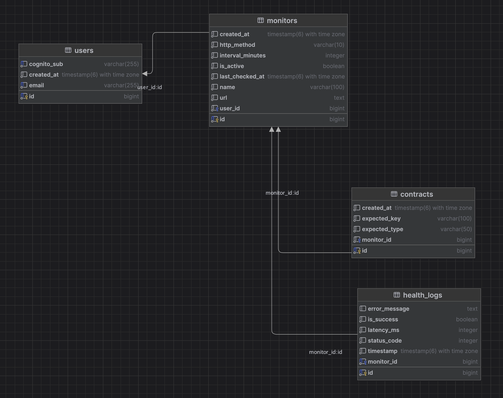

# PayloadWatch 🛡️

**PayloadWatch** is a cloud-native API observability platform designed to catch silent data failures that standard uptime monitors miss. 

While traditional monitors only verify `HTTP 200 OK` status codes, PayloadWatch acts as an automated contract enforcer. It utilizes an autonomous Spring Boot polling engine to continuously evaluate external API responses against user-defined JSON schemas. By validating structural integrity and the presence of critical data fields in real-time, it guarantees backend reliability and prevents broken payloads from reaching the client.

## ✨ Key Features

* **JSON Contract Validation:** Goes beyond basic pinging by actively parsing response payloads via Jackson to ensure required data keys and types are present.
* **Autonomous Polling Engine:** A multithreaded `@Scheduled` Spring Boot worker that manages its own execution cycles and database querying without blocking main threads.
* **Event-Driven Alerting:** Integrates with Amazon SES to instantly dispatch low-latency email alerts upon detecting degraded API performance or breached data contracts.
* **Stateless Security:** Secures all REST endpoints utilizing AWS Cognito for JWT-based identity management and route protection.
* **Lightweight Dashboard:** A blazing-fast, framework-free Vanilla JavaScript (Vite) Single Page Application (SPA) for managing monitors and viewing health metrics.

## 🏗️ Architecture & Tech Stack

### 🗄️ Database Architecture

PayloadWatch is built on a fully normalized PostgreSQL relational database. The schema separates core user data from the high-volume background logging engine to ensure scalable polling performance.



**Backend & Core Engine**
* **Java 21 & Spring Boot 3:** Core REST API and background task scheduling.
* **Spring Data JPA & Hibernate:** ORM for database interactions.
* **Jackson:** High-performance JSON parsing.

**Infrastructure & Cloud (AWS)**
* **AWS ECS (Fargate) & ECR:** Serverless container orchestration and image registry.
* **AWS Cognito:** Identity Provider (IdP) for JWT generation.
* **Amazon SES:** Event-driven email alerting.
* **Amazon RDS:** Managed PostgreSQL database hosting.

**Frontend & DevOps**
* **Vanilla TypeScript/JavaScript:** Raw DOM manipulation and asynchronous `fetch` logic.
* **Docker & Docker Compose:** Containerization for absolute parity between local and production environments.
* **PostgreSQL:** Relational database for persistent storage of contracts and health logs.

## 🚀 Getting Started (Local Development)

You can spin up the entire PayloadWatch backend and database in seconds using Docker Compose.

### Prerequisites
* [Docker Desktop](https://www.docker.com/products/docker-desktop/) installed and running.
* An AWS Account (for Cognito and SES configuration).

### 1. Clone the Repository
```bash
git clone [https://github.com/yourusername/payloadwatch.git](https://github.com/yourusername/payloadwatch.git)
cd payloadwatch
